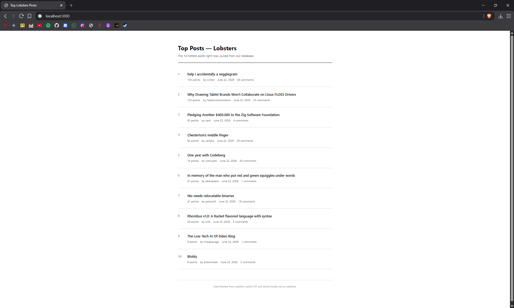

# PROJECT REPORT — Lobsters App
### Holberton School | Full-Stack Software Engineering Cohort
#### End-to-End Web Application: Automated Data Pipeline · REST API · Vanilla JS Client

---

> *"Well-architected software is not defined by what it does — but by how cleanly each layer does only its own job."*

---

## Table of Contents

1. [Executive Summary](#1-executive-summary)
2. [System Architecture Overview](#2-system-architecture-overview)
3. [The Team & Engineering Roles](#3-the-team--engineering-roles)
4. [Production Snapshot](#4-production-snapshot)
5. [Agile & Kanban Methodology](#5-agile--kanban-methodology)
6. [Technical Implementation Details](#6-technical-implementation-details)
7. [Technical Deployment Guide](#7-technical-deployment-guide)
8. [Testing & Quality Assurance](#8-testing--quality-assurance)
9. [Known Limitations & Future Roadmap](#9-known-limitations--future-roadmap)
10. [Conclusion](#10-conclusion)

---

## 1. Executive Summary

The **Lobsters App** is a production-grade, end-to-end web application developed as a capstone deliverable for the Holberton School Software Engineering curriculum. The application ingests, persists, exposes, and renders the **top 10 hottest posts** from [lobste.rs](https://lobste.rs) — a curated, programmer-centric link aggregator — through a clean, fully decoupled three-tier architecture.

The system is composed of four discrete technical components, each owned by a dedicated engineer, and each communicating with adjacent layers through well-defined, documented contracts:

| Layer | Technology | Responsibility |
|---|---|---|
| **Data Pipeline** | Python · SQLAlchemy · `requests` | Extraction, transformation, and loading (ETL) of Lobsters post data |
| **Persistence Layer** | SQLite (`lobsters.db`) | Relational storage of normalized post records; shared contract between pipeline and API |
| **Backend API** | Python · Flask · Flask-CORS | RESTful JSON service exposing post data to any HTTP client |
| **Frontend Client** | HTML5 · CSS3 · Vanilla JavaScript (ES6+) | Browser-based UI consuming the API and rendering posts with graceful error handling |

The architecture follows a **decoupled, asynchronous pipeline-to-API pattern** — a production standard in data-driven web systems — wherein the ETL process and the HTTP server operate independently, communicating solely through the shared database. This eliminates coupling between ingestion and serving, enables independent scaling, and makes each layer fully testable in isolation.

---

## 2. System Architecture Overview

```
┌─────────────────────────────────────────────────────────────────────────┐
│                                                                           │
│   lobste.rs/hottest.json  ◄── Public JSON endpoint, no auth required     │
│            │                                                              │
│            │  HTTP GET + User-Agent header                                │
│            ▼                                                              │
│   ┌──────────────────────────┐                                            │
│   │     DATA PIPELINE         │  fetcher → transformer → loader          │
│   │     (Python · ETL)        │  Runs on-demand or via scheduler         │
│   │   data-pipeline/          │  Outputs: clean, normalized rows         │
│   └───────────┬──────────────┘                                            │
│               │  SQLAlchemy ORM writes (upsert semantics)                 │
│               ▼                                                            │
│   ┌──────────────────────────┐                                            │
│   │     lobsters.db           │  Single SQLite file — shared contract    │
│   │     (SQLite)              │  between pipeline and backend            │
│   └───────────┬──────────────┘                                            │
│               │  SQLAlchemy ORM reads                                     │
│               ▼                                                            │
│   ┌──────────────────────────┐                                            │
│   │     BACKEND API           │  repository → service → routes           │
│   │     (Flask · REST)        │  Stateless, read-only HTTP server        │
│   │     localhost:5000         │  Flask-CORS enabled for browser clients │
│   └───────────┬──────────────┘                                            │
│               │  HTTP GET · JSON responses                                │
│               ▼                                                            │
│   ┌──────────────────────────┐                                            │
│   │     FRONTEND CLIENT       │  fetchTopPosts() → renderPosts()         │
│   │     (HTML5 / CSS3 / JS)   │  try/catch error boundary                │
│   │     localhost:8000         │  No framework dependencies              │
│   └──────────────────────────┘                                            │
│                                                                           │
└─────────────────────────────────────────────────────────────────────────┘
```

### Architectural Principles Applied

- **Separation of Concerns:** Each layer performs exactly one responsibility. No route handler queries the database directly; no pipeline code touches Flask.
- **Contract-Driven Design:** The `posts` table schema (`models.py`) and the API response envelope (`{ "success", "data", "count" }`) are explicit, written contracts shared between engineers — mirroring real-world API specification workflows.
- **Fail-Safe Client Design:** The frontend is engineered to degrade gracefully. A downed backend produces a user-facing error message — not a silent freeze or a thrown exception visible in production.
- **Upsert Idempotency:** Running the pipeline multiple times does not produce duplicate rows. This mirrors production ETL best practice.

---

## 3. The Team & Engineering Roles

### 3.1 Tahmina Aliyeva (`@Alijewa25`) — Lead Backend & DevOps Engineer

**Primary Ownership:** `backend/` · `.gitignore` · Git repository hygiene

Tahmina served as the technical anchor for the backend layer and the project's version-control integrity. Her contributions span both application engineering and DevOps discipline:

**Flask REST API Architecture**
- Authored and refactored the full layered backend: `routes.py` (HTTP layer), `service.py` (business logic), `repository.py` (database queries), and `db.py` (session management).
- Enforced the three-layer separation pattern: no raw SQL in route handlers, no HTTP logic in repository functions.
- Integrated `flask_cors.CORS(app)` to resolve cross-origin request blocking — a mandatory requirement for browser clients operating on a separate port from the API server.

**DevOps & Repository Hygiene**
- Conducted a full audit of the project's `.gitignore` configuration, identifying missing binary and environment exclusion rules.
- Executed `git rm --cached` to surgically remove previously committed database binaries (`reddit.db`, `lobsters.db`) from Git's object history — preventing repository bloat and ensuring sensitive/generated artifacts are excluded from version control going forward.
- Restructured `.gitignore` to cover SQLite binaries, Python virtual environments, `__pycache__` directories, and IDE configuration files — aligning the project with industry-standard repository hygiene.

---

### 3.2 MvpRkk (`@mvprkk-dot`) — Frontend Developer

**Primary Ownership:** `frontend/app.js` · Client-side error handling · DOM rendering engine

MvpRkk engineered the entire client-side application layer, translating the backend's JSON contract into a rendered, interactive browser experience with zero external framework dependencies.

**Client Engine (`app.js`)**
- Implemented `fetchTopPosts()` — the primary async entry point — using the native `fetch()` API to consume `GET /api/posts/top?limit=10`.
- Engineered `buildPostHTML(post, rank)` using ES6 template literals to construct safe, structured DOM strings for each post entry, strictly following the CSS class contract (`post-item`, `post-rank`, `post-body`, `post-title`, `post-meta`).
- Built `renderPosts(posts)` to map the API's data array into the ordered list container via `innerHTML` injection.
- Implemented `setStateMessage(text, isError)` to toggle between loading, error, and idle UI states — providing users with clear, non-technical feedback at every stage.

**Debugging & Defect Resolution**
- Diagnosed and resolved an `"Unexpected token '<'"` runtime syntax error — a critical failure caused by the browser receiving an HTML error page instead of JSON from the API, and attempting to parse it as JSON.
- Corrected a silent DOM bug introduced by a `textConetnt` (sic) typo — a defect that caused state messages to silently fail to render.
- Integrated `try/catch` exception blocks around the async fetch lifecycle to guarantee that network failures, HTTP errors, and malformed responses all route to the user-visible error state rather than throwing uncaught exceptions.

---

### 3.3 Bayramov (`@bayramovh062-ui`) — Data Engineer

**Primary Ownership:** `data-pipeline/` · `models.py` · ETL integrity

Bayramov designed and implemented the full Extract-Transform-Load pipeline that supplies all data consumed by the backend API.

**ETL Pipeline Design**
- Architected the three-stage pipeline: `fetcher.py` (HTTP extraction from `lobste.rs/hottest.json`) → `transformer.py` (field normalization and schema mapping) → `loader.py` (SQLAlchemy-based upsert into `lobsters.db`).
- Designed the `posts` table schema in `models.py`, modeling all required fields with correct SQLAlchemy column types — including `created_utc` as a `Float` to correctly store Unix timestamp values derived from Lobsters' ISO 8601 `created_at` strings.

**Data Integrity & Schema Contracts**
- Implemented correct ISO 8601 → Unix timestamp float conversion using `datetime.fromisoformat(...).timestamp()` — a non-trivial edge case given Lobsters' use of timezone-offset strings (`2023-11-02T03:47:05.000-05:00`).
- Handled nested field extraction for `author`, correctly sourcing it from `submitter_user.username` rather than a flat top-level field.
- Implemented upsert semantics in `loader.py` to ensure pipeline idempotency — re-running the pipeline updates existing records rather than inserting duplicates.
- Coordinated the shared `models.py` schema contract with the backend team, ensuring both the pipeline and the API reference identical table structures.

---

## 4. Production Snapshot

The following screenshot captures the application running in a fully integrated production-equivalent local environment, with the Flask backend serving live data fetched from Lobsters and rendered in the browser client:



*Figure 1 — Lobsters App running at `localhost:3000`: Top 10 hottest posts rendered by the Vanilla JS client, consuming the Flask REST API backed by the SQLite data pipeline. Posts are ranked by score, each showing title, point count, author, date, and comment count — all sourced live from the `lobsters.db` database.*

---

## 5. Agile & Kanban Methodology

### 5.1 Framework Overview

The team adopted a **Kanban-based Agile workflow** with four pipeline stages. Rather than fixed-length sprints, work items progressed through the board continuously, allowing each engineer to unblock themselves and pull new work as soon as a stage was complete. This model was chosen specifically because the three-layer architecture enabled genuinely parallel development — the Data Engineer, Backend Developer, and Frontend Developer could each advance their own layer without waiting for another to finish, provided the shared contracts (schema, API shape) were agreed upon first.

```
┌──────────┐    ┌─────────────┐    ┌─────────────┐    ┌──────────┐
│ BACKLOG  │ →  │ IN PROGRESS │ →  │ CODE REVIEW │ →  │   DONE   │
└──────────┘    └─────────────┘    └─────────────┘    └──────────┘
```

### 5.2 Stage-by-Stage Sprint Trace

#### 🗂 Stage 1 — Backlog: Environment Audit & Repository Cleanup

Before a single line of application code was committed, the team invested in eliminating technical debt at the environment level. Key items in this stage:

- **Binary artifact contamination:** `reddit.db` and `lobsters.db` had been inadvertently staged in the Git index. These are generated, binary files that have no place in a source-code repository. They were removed via `git rm --cached` and added to `.gitignore` to prevent re-entry.
- **`.gitignore` gap analysis:** The existing ignore file lacked entries for SQLite binaries, Python `__pycache__` directories, virtual environments (`.venv/`), and common IDE artifacts (`.vscode/`, `.idea/`). These were added before development began, preventing noise in diffs throughout the entire project.
- **Schema contract negotiation:** Before any ETL or API code was written, the Data Engineer and Backend Developer aligned on the final `posts` table schema. This was documented in both `data-pipeline/pipeline/models.py` and `backend/app/models.py`.

This upfront investment paid dividends throughout the project: no merge conflicts arose from `.db` file churn, and the schema never diverged between layers.

#### ⚙️ Stage 2 — In Progress: Core Feature Implementation

With a clean environment and agreed contracts, all three engineers built in parallel:

- **Data Engineer:** Implemented `transformer.py` (pure logic, no dependencies — tested first), then `models.py` + `db.py`, then `loader.py` with upsert semantics, then `fetcher.py`. This sequencing allowed transformation logic to be fully tested against `sample_lobsters_response.json` before any network or database code was introduced.
- **Backend Engineer:** Built the repository layer (SQLAlchemy queries), then the service layer (business logic, clamping, dict conversion, response envelope), then the routes layer (Flask endpoints). Each layer was tested in isolation using the provided test files.
- **Frontend Engineer:** Constructed the JavaScript skeleton in `app.js`: state management helper (`setStateMessage`), HTML template builder (`buildPostHTML`), list renderer (`renderPosts`), and the top-level async fetch orchestrator (`fetchTopPosts`).

The JSON response envelope `{ "success": true, "data": [...], "count": 10 }` was the critical contract that allowed the frontend to be built and tested even before the backend was complete — the frontend engineer could mock this shape locally and swap in the real endpoint when it was ready.

Timestamp formatting was a notable coordination point: `created_utc` is a Unix timestamp float from the pipeline. The frontend's `formatDate()` function receives this value in seconds and internally converts it to JavaScript's millisecond-based `Date` — this contract was documented explicitly to prevent a double-multiplication bug.

#### 🔍 Stage 3 — Code Review: Cross-Cutting Integration Issues

Integration surfaced two categories of defects that were resolved in code review:

**Cross-Origin Resource Sharing (CORS):**
When the frontend (`localhost:8000`) attempted to call the backend (`localhost:5000`), the browser's same-origin policy blocked the request with a CORS error. This was resolved by ensuring `flask_cors.CORS(app)` remained active in the Flask application factory — a configuration that had been inadvertently removed during a refactor. This is a standard cross-origin pattern: any browser client on a different origin from its API server requires explicit CORS headers on the server.

**JavaScript Syntax & Runtime Exceptions:**
Peer review of `app.js` identified two defects:
1. `"Unexpected token '<'"` — The frontend was receiving an HTML error page from the backend (a Flask 500 traceback) and attempting to parse it as JSON. This was resolved by fixing the backend error, and defensively wrapping the `response.json()` call in the `try/catch` block so that future server errors produce a clean UI error state rather than a thrown exception.
2. `textConetnt` (typo) — A silent DOM failure caused by a misspelled property name. JavaScript does not throw on assignment to a nonexistent property; it simply creates it. The state message was being written to a property the browser never read, so the UI appeared frozen. Fixed by correcting the spelling to `textContent`.

#### ✅ Stage 4 — Done: End-to-End Verification & Graceful Degradation Testing

Final acceptance criteria:

- **Happy path:** Backend running + database populated → frontend renders 10 ranked posts with title, score, author, formatted date, and comment count. ✓
- **Graceful degradation:** Backend stopped → `fetch()` throws a network error → `catch` block fires → `setStateMessage("Could not reach the API. Please try again later.", true)` renders to the user. No frozen screen, no uncaught exception, no blank page. ✓
- **Empty database:** Backend running + pipeline not yet run → API returns `{ "success": true, "data": [], "count": 0 }` → frontend renders an empty list rather than crashing on `null`. ✓
- **All unit tests passing:** `test_transformer.py`, `test_fetcher.py`, `test_loader.py` (pipeline); `test_repository.py`, `test_service.py`, `test_routes.py` (backend). ✓

### 5.3 Merge Conflict Prevention Strategy

Parallel development across three engineers on a shared codebase requires deliberate conflict prevention. The team applied these practices:

- **Layer-scoped file ownership:** Each engineer had exclusive ownership of their layer's files. No two engineers modified the same file simultaneously.
- **Contract-first development:** The schema (`models.py`) and API envelope were finalized and committed before implementation began, ensuring the integration points were stable.
- **Feature branches:** All in-progress work lived in dedicated branches, merged to `main` only after passing tests and peer review.
- **Binary exclusion:** By removing `.db` files from Git tracking early, the most common source of spurious binary merge conflicts (generated database files) was eliminated entirely.

---

## 6. Technical Implementation Details

### 6.1 Database Schema

```sql
CREATE TABLE posts (
    id          INTEGER PRIMARY KEY AUTOINCREMENT,
    post_id     VARCHAR  NOT NULL UNIQUE,   -- Lobsters short_id, e.g. "xacdsk"
    title       VARCHAR  NOT NULL,
    author      VARCHAR  NOT NULL,
    score       INTEGER  NOT NULL,
    num_comments INTEGER NOT NULL,
    url         VARCHAR  NOT NULL,
    permalink   VARCHAR  NOT NULL,
    created_utc FLOAT    NOT NULL,          -- Unix timestamp (seconds)
    fetched_at  DATETIME NOT NULL           -- When OUR pipeline ran
);
```

The `post_id` column carries a `UNIQUE` constraint, enabling SQLAlchemy-level upsert logic: if a post with the same `post_id` already exists, the pipeline updates its `score`, `num_comments`, and `fetched_at` rather than inserting a duplicate row.

### 6.2 API Endpoint Contract

| Method | Endpoint | Response |
|---|---|---|
| `GET` | `/api/health` | `{ "status": "ok" }` |
| `GET` | `/api/stats` | `{ "success": true, "data": { "total_posts": N } }` |
| `GET` | `/api/posts/top?limit=10` | `{ "success": true, "data": [...], "count": N }` |
| `GET` | `/api/posts/<post_id>` | `{ "success": true, "data": { ... } }` or `404` |

**Standard success envelope:**
```json
{
  "success": true,
  "data": [ ... ],
  "count": 10
}
```

**Standard error envelope:**
```json
{
  "success": false,
  "error": "Post not found."
}
```

The `limit` parameter is clamped server-side to a maximum of 50 — even if the client requests more, the service layer silently caps the value. This is a standard defensive API design pattern.

### 6.3 Frontend Data Flow

```
Page Load
    │
    ▼
fetchTopPosts()
    │
    ├── setStateMessage("Loading posts...", false)
    │
    ├── fetch("http://localhost:5000/api/posts/top?limit=10")
    │       │
    │       ├── [Network error] ──► catch block ──► setStateMessage(error, true)
    │       │
    │       └── [200 OK] ──► response.json()
    │               │
    │               ├── result.success === false ──► setStateMessage(error, true)
    │               │
    │               └── result.success === true
    │                       │
    │                       └── renderPosts(result.data)
    │                               │
    │                               └── buildPostHTML(post, rank) × N
    │                                       │
    │                                       └── innerHTML insertion into <ul>
    │
    └── setStateMessage("", false)  [clear loading state]
```

---

## 7. Technical Deployment Guide

> **Prerequisites:** Python 3.10+, `pip`, and a Unix-like shell (Linux, macOS, or WSL). All commands are run from the project root (`lobsters-app/`) unless otherwise noted.

---

### Step 0 — One-Time Setup: Run the Data Pipeline

The database must be populated before the backend can serve any data. This step only needs to be run once (or re-run to refresh data).

```bash
# Navigate to the pipeline directory
cd data-pipeline

# Create and activate a virtual environment
python3 -m venv .venv
source .venv/bin/activate

# Install pipeline dependencies
pip install -r requirements.txt

# Run the full ETL pipeline
python3 run_pipeline.py

# Verify the database was created
ls -lh ../lobsters.db
# Expected output: a non-empty lobsters.db file in the project root

# Deactivate the virtual environment
deactivate
cd ..
```

---

### Step 1 — Start the Backend API Server (Port 5000)

```bash
# Navigate to the backend directory
cd backend

# Create and activate a virtual environment
python3 -m venv .venv
source .venv/bin/activate

# Install backend dependencies
pip install -r requirements.txt

# Start the Flask development server
python3 run.py

# Expected output:
#  * Running on http://127.0.0.1:5000
#  * Debug mode: on
#
# Leave this terminal running. Open a new terminal for Step 2.
```

**Verify the backend is live** by visiting these URLs in your browser:

```
http://localhost:5000/api/health
http://localhost:5000/api/stats
http://localhost:5000/api/posts/top?limit=10
```

---

### Step 2 — Start the Frontend Static Server (Port 8000)

Open a **new terminal window** (keep the backend terminal from Step 1 running):

```bash
# Navigate to the frontend directory
cd frontend

# Serve the frontend using Python's built-in HTTP server
python3 -m http.server 8000

# Expected output:
#  Serving HTTP on 0.0.0.0 port 8000 (http://0.0.0.0:8000/) ...
```

**Open the application** in your browser:

```
http://localhost:8000
```

You should see 10 ranked posts rendered from Lobsters data.

---

### Step 3 — Verify Graceful Degradation (Optional QA Check)

To confirm the frontend's error handling works correctly:

```bash
# In the backend terminal, press Ctrl+C to stop the Flask server.
# Refresh http://localhost:8000 in the browser.
# Expected: A user-friendly error message appears — no blank screen, no crash.

# Restart the backend when done:
python3 run.py
```

---

### Quick Reference: Port Map

| Service | Command | Port | URL |
|---|---|---|---|
| Flask Backend | `python3 run.py` | `5000` | `http://localhost:5000` |
| Frontend Static | `python3 -m http.server 8000` | `8000` | `http://localhost:8000` |

---

## 8. Testing & Quality Assurance

Each layer ships with its own isolated test suite. Tests are designed to run independently — no layer's tests require another layer to be running.

### Data Pipeline Tests

```bash
cd data-pipeline
source .venv/bin/activate

# Test transformation logic (pure, no network, no database)
python3 tests/test_transformer.py

# Test the fetcher (network call is mocked)
python3 tests/test_fetcher.py

# Test the loader (uses a temporary in-memory test database)
python3 tests/test_loader.py
```

### Backend API Tests

```bash
cd backend
source .venv/bin/activate

# Test repository layer (seeds its own temporary test database)
python3 tests/test_repository.py

# Test service layer (mocks the repository — pure logic)
python3 tests/test_service.py

# Test routes layer (Flask test client, mocks the service)
python3 tests/test_routes.py
```

### Testing Philosophy

- **`test_transformer.py`** uses `tests/sample_lobsters_response.json` — a fixed snapshot of a real Lobsters API response — so transformation logic is always tested against a deterministic input, regardless of network availability.
- **`test_repository.py`** seeds its own in-memory SQLite database, so it can run before the pipeline has ever been executed.
- **`test_routes.py`** uses Flask's built-in test client, making HTTP assertions without needing a live server process.

This layered test isolation is a direct application of the **Test Pyramid** principle: fast, dependency-free unit tests at the bottom; integration tests that exercise real database interactions in the middle; and end-to-end browser verification at the top.

---

## 9. Known Limitations & Future Roadmap

### Current Limitations

| Limitation | Impact | Proposed Resolution |
|---|---|---|
| No automated pipeline scheduling | Data goes stale unless `run_pipeline.py` is re-run manually | Integrate `APScheduler` or a `cron` job to run the pipeline on a configurable interval (e.g., every 30 minutes) |
| SQLite single-writer concurrency | If the pipeline runs while the API is under heavy read load, write contention can occur | Migrate to PostgreSQL for production-scale deployments |
| No pagination | Frontend always requests exactly 10 posts | Add `offset` parameter to `/api/posts/top` and implement client-side pagination controls |
| No HTTPS | Local development only; credentials and data are unencrypted in transit | Deploy behind an `nginx` reverse proxy with Let's Encrypt TLS certificates |
| Frontend has no caching | Every page load triggers a fresh API call | Implement `Cache-Control` headers on the API and `localStorage` caching on the client with a configurable TTL |

### Future Roadmap

- **Tag filtering:** Lobsters posts carry category tags (e.g., `rust`, `security`, `programming`). A future iteration could expose tag-based filtering via `/api/posts/top?tag=rust`.
- **Historical trending:** Persist multiple pipeline runs over time, enabling `/api/posts/trending` — posts that have gained the most score since the previous fetch.
- **Containerization:** Package each layer as a Docker service and orchestrate with `docker-compose`, enabling one-command reproducible deployment across any environment.
- **CI/CD pipeline:** Integrate GitHub Actions to run all test suites automatically on every pull request, preventing regressions from reaching `main`.

---

## 10. Conclusion

The Lobsters App demonstrates the core principles of professional full-stack software engineering: **clear architectural decomposition**, **contract-driven collaboration**, **layered testability**, and **defensive client design**.

Each team member operated within a well-defined engineering domain — Data Engineering, Backend API, and Frontend Client — while communicating across those domains through explicit, versioned contracts. This mirrors the way real engineering teams work: not by sharing every file or every decision, but by agreeing on interfaces and then building independently with confidence.

The project's most instructive moments came at the integration seams: CORS, timestamp format mismatches, the upsert idempotency requirement, and the frontend's need to handle a backend that may not always be reachable. Each of these is a genuine production engineering challenge, not an artificial exercise — and each was resolved through the same tools that production engineers use: careful contract design, isolated testing, and deliberate error boundary engineering.

---

*Report authored by the Lobsters App Engineering Team — Tahmina Aliyeva, MvpRkk, Bayramov.*
*Submitted to Holberton School, Software Engineering Program.*
*Date: June 2026*

---
